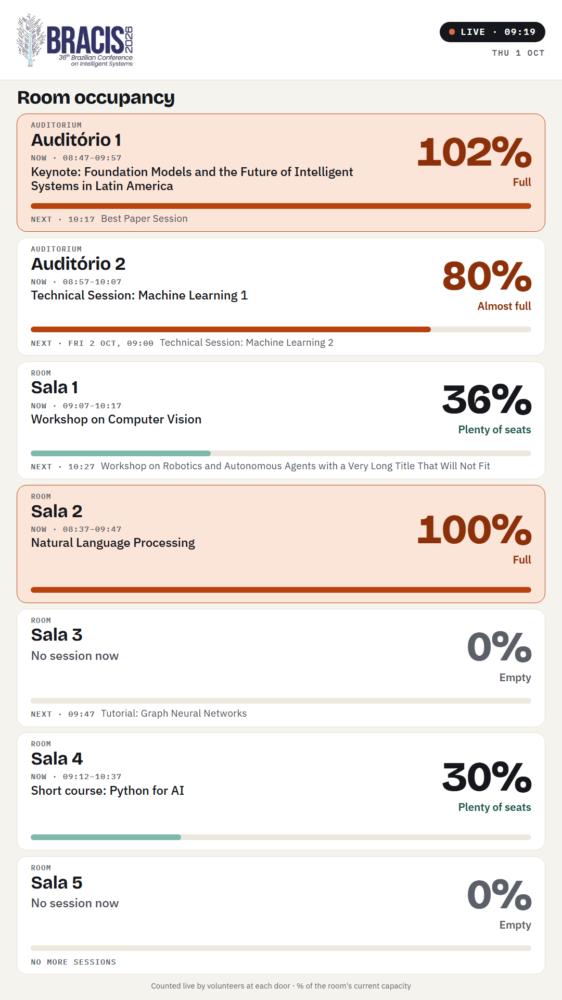

# Ocupação das salas do BRACIS 2026

Site que mostra em tempo real a lotação (em %) de cada sala do BRACIS 2026 (19 a 22 de outubro,
UniSENAI, Cuiabá) e o que está acontecendo nela. Voluntários na porta de cada sala registram pelo
celular quem entra e quem sai, e um totem digital mostra a lotação para os participantes.

Cada entrada e saída fica gravada no banco (sala, horário e voluntário), e depois do evento sai um
relatório de quantas pessoas passaram por cada sessão.

No ar em https://bracis.ic.ufmt.br/live/

  
   Tela do totem (dados de exemplo)

## Páginas

O site todo fica debaixo de `/live`.

| Endereço | Para quem | O que tem |
|---|---|---|
| `/live/` | Totem | Tela única, em pé, sem botões e sem rolagem, só em inglês: as 7 salas com a % de lotação, a sessão de agora e a próxima |
| `/live/voluntario` | Voluntários | Contagem na porta: +1, −1, várias pessoas de uma vez e Desfazer (login com e-mail e PIN) |
| `/live/coordenacao` | Coordenação | Situação das salas, capacidade de cada sala, voluntários (cadastro, importação, novo PIN, desativar), relatório por sessão e histórico em CSV |

Por que só %: a capacidade das salas muda conforme o momento do congresso. A coordenação muda a
capacidade no painel e o totem passa a mostrar a % com a capacidade nova em até 10 segundos.
Os voluntários e a coordenação continuam vendo o número exato de pessoas.

**Níveis de lotação** (regra única, em `static/comum.js`): Empty (sem sessão e ninguém dentro),
Plenty of seats (menos de 40%), Filling up (40 a 74%), Almost full (75 a 99%) e Full (100% ou mais).

O totem recarrega a página sozinho a cada hora (só se o servidor estiver respondendo), para pegar
versões novas do site. Sem conexão por mais de 2 minutos, os cartões ficam apagados.

## Onde fica cada coisa

| Arquivo | O que faz |
|---|---|
| `main.py` | Servidor (FastAPI): páginas, login, contagem, painel da coordenação |
| `database.py` | Banco SQLite e a **lista das salas** (`AMBIENTES_EXEMPLO`: código, nome, tipo e capacidade inicial; depois a capacidade é mudada no painel) |
| `programacao.py` | Lê a planilha da programação (Google Sheets publicado como CSV) |
| `relatorio.py` | Relatório por sessão (entradas, saídas e pico de público) |
| `static/` | Páginas: `index.html` (totem), `voluntario.html`, `coordenacao.html` |
| `static/tokens.css`, `static/publico.css` | Visual do totem (cores, fontes e tamanhos proporcionais à tela) |
| `static/estilo.css`, `static/pico.min.css` | Visual das páginas dos voluntários e da coordenação (em cima do Pico CSS) |
| `static/fontes/` | Fontes do site e as licenças delas (OFL) |
| `static/comum.js` | Regras do totem (nível de lotação, ordem das salas, horários) |
| `static/participante.js` | Monta a tela do totem e atualiza a cada 10 s |
| `static/logo-bracis.png` | Logo oficial do media kit (fundo transparente, 1200 × 500), no topo de todas as páginas |
| `deploy/` | Arquivos do servidor e o passo a passo de instalação (`deploy/INSTALACAO.md`) |
| `testes/` | Testes automáticos e de carga (ver `testes/README.md`) |
| `docs/` | Imagens usadas neste README |

## Programação (planilha)

A programação vem de uma planilha do Google Sheets publicada como CSV (o link fica em `URL_PROGRAMACAO`
no `.env`). O site relê a planilha ao ligar, a cada 10 minutos e pelo botão no painel da coordenação.
Colunas:

| Sala | Data | Inicio | Fim | Titulo | Palestrante |
|---|---|---|---|---|---|
| A1 (ou o nome da sala) | 20/10/2026 | 09:00 | 10:00 | Abertura do BRACIS 2026 | Organização |

Sem `URL_PROGRAMACAO`, o site usa o arquivo `programacao_exemplo.csv`.

## Como rodar no computador

Precisa do Python 3 e, para os testes, do Node.js.

1. Crie e ative o ambiente virtual:

       python -m venv .venv
       .\.venv\Scripts\Activate.ps1     # Windows (PowerShell)
       source .venv/bin/activate        # Linux ou Mac

2. Instale as dependências:

       pip install -r requirements.txt

3. Copie `.env.example` para `.env` e preencha (para testar no computador, use
   `CRIAR_VOLUNTARIOS_EXEMPLO=sim`: voluntários de teste com PIN 1111, 2222 e 3333).

4. Rode o servidor e abra http://127.0.0.1:8000/live/

       uvicorn main:app --reload

5. Antes de enviar mudanças, rode os testes:

       python testes/rodar_testes.py

## Como atualizar o site no ar

1. Envie as mudanças para o GitHub (`git push`) e, no servidor, rode `cd /opt/bracis && git pull`.
2. **Mudou algum arquivo `.py`?** Reinicie o site: `sudo systemctl restart bracis`.
   Mudou só a pasta `static/`? Não precisa reiniciar.
3. **Mudou CSS ou JavaScript do totem?** Troque o número de versão `?v=N` no `index.html`, por
   exemplo de `?v=5` para `?v=6`. Assim o navegador baixa os arquivos novos em vez de usar os guardados
   (o totem pega a versão nova em até 1 hora, quando recarrega sozinho).

Para instalar num servidor novo, veja [deploy/INSTALACAO.md](deploy/INSTALACAO.md).

## Tecnologias

Python (FastAPI, Uvicorn), SQLite, HTML, CSS e JavaScript sem framework. Nginx na frente, no servidor da
UFMT. Fontes Bricolage Grotesque e IBM Plex Sans guardadas no próprio site (licença OFL).

## Licença

Código sob a licença MIT (ver [LICENSE](LICENSE)). As fontes em `static/fontes/` seguem a SIL Open Font
License, com o texto de cada uma na mesma pasta. O Pico CSS é MIT.
