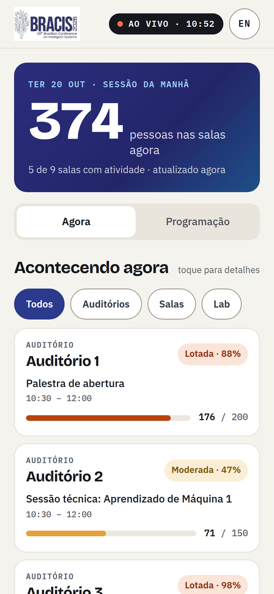

# Ocupação das salas do BRACIS 2026

Site que mostra em tempo real quantas pessoas estão em cada sala do BRACIS 2026 (19 a 22 de outubro,
UniSENAI, Cuiabá) e o que está acontecendo nela. Voluntários na porta de cada sala registram pelo
celular quem entra e quem sai, e os participantes acompanham a lotação sem precisar de login.

Cada entrada e saída fica gravada no banco (sala, horário e voluntário), e depois do evento sai um
relatório de quantas pessoas passaram por cada sessão.

No ar em https://bracis.ic.ufmt.br/live/

  
   Tela "Agora" no celular (dados de exemplo)

## Páginas

O site todo fica debaixo de `/live`.

| Endereço | Para quem | O que tem |
|---|---|---|
| `/live/` | Participantes | Tela "Agora": total de pessoas, cartão de cada sala com a sessão atual e o nível de lotação |
| `/live/programacao` | Participantes | Todas as sessões por dia e por horário, com o selo AGORA |
| `/live/sala/A1` | Participantes | Uma sala: lotação, sessão de agora, pico de pessoas por hora e o que vem a seguir |
| `/live/voluntario` | Voluntários | Contagem na porta: +1, −1, várias pessoas de uma vez e Desfazer (login com e-mail e PIN) |
| `/live/coordenacao` | Coordenação | Situação das salas, voluntários (cadastro, importação, novo PIN, desativar), relatório por sessão e histórico em CSV |

As páginas públicas funcionam em **português e inglês**: botão EN/PT no topo, escolha automática pelo
idioma do celular, ou o endereço com `?lang=en`.

**Níveis de lotação** (regra única, em `static/comum.js`): Livre (sem sessão e ninguém dentro),
Tranquila (menos de 40%), Moderada (40 a 74%), Lotada (75 a 99%) e Cheia (100% ou mais).

## Onde fica cada coisa

| Arquivo | O que faz |
|---|---|
| `main.py` | Servidor (FastAPI): páginas, login, contagem, painel da coordenação |
| `database.py` | Banco SQLite e a **lista das salas** (`AMBIENTES_EXEMPLO`: código, nome, tipo, capacidade) |
| `programacao.py` | Lê a planilha da programação (Google Sheets publicado como CSV) |
| `relatorio.py` | Relatório por sessão (entradas, saídas e pico de público) |
| `static/` | Páginas: `index.html`, `programacao.html`, `sala.html` (públicas) e `voluntario.html`, `coordenacao.html` |
| `static/tokens.css`, `static/publico.css` | Visual das páginas públicas (cores, fontes e componentes) |
| `static/estilo.css`, `static/pico.min.css` | Visual das páginas dos voluntários e da coordenação (em cima do Pico CSS) |
| `static/fontes/` | Fontes do site e as licenças delas (OFL) |
| `static/idioma.js` | Todos os textos das páginas públicas em português e inglês |
| `static/comum.js` | Regras usadas pelas páginas públicas (nível de lotação, ordem das salas, picos por hora) |
| `deploy/` | Arquivos do servidor e o passo a passo de instalação (`deploy/INSTALACAO.md`) |
| `testes/` | Testes automáticos e de carga (ver `testes/README.md`) |
| `docs/` | Imagens usadas neste README |

## Programação (planilha)

A programação vem de uma planilha do Google Sheets publicada como CSV (o link fica em `URL_PROGRAMACAO`
no `.env`). O site relê a planilha ao ligar, a cada 10 minutos e pelo botão no painel da coordenação.
Colunas:

| Sala | Data | Inicio | Fim | Titulo | Palestrante |
|---|---|---|---|---|---|
| A1 (ou o nome da sala) | 20/10/2026 | 09:00 | 10:00 | Abertura do BRACIS 2026 | Organização |

Sem `URL_PROGRAMACAO`, o site usa o arquivo `programacao_exemplo.csv`.

## Como rodar no computador

Precisa do Python 3 e, para os testes, do Node.js.

1. Crie e ative o ambiente virtual:

       python -m venv .venv
       .\.venv\Scripts\Activate.ps1     # Windows (PowerShell)
       source .venv/bin/activate        # Linux ou Mac

2. Instale as dependências:

       pip install -r requirements.txt

3. Copie `.env.example` para `.env` e preencha (para testar no computador, use
   `CRIAR_VOLUNTARIOS_EXEMPLO=sim`: voluntários de teste com PIN 1111, 2222 e 3333).

4. Rode o servidor e abra http://127.0.0.1:8000/live/

       uvicorn main:app --reload

5. Antes de enviar mudanças, rode os testes:

       python testes/rodar_testes.py

## Como atualizar o site no ar

1. Envie as mudanças para o GitHub (`git push`) e, no servidor, rode `cd /opt/bracis && git pull`.
2. **Mudou algum arquivo `.py`?** Reinicie o site: `sudo systemctl restart bracis`.
   Mudou só a pasta `static/`? Não precisa reiniciar.
3. **Mudou CSS ou JavaScript das páginas públicas?** Troque o número de versão `?v=N` nos três HTML
   públicos (`index.html`, `programacao.html`, `sala.html`), por exemplo de `?v=4` para `?v=5`. Assim o
   celular baixa os arquivos novos em vez de usar os guardados.

Para instalar num servidor novo, veja [deploy/INSTALACAO.md](deploy/INSTALACAO.md).

## Tecnologias

Python (FastAPI, Uvicorn), SQLite, HTML, CSS e JavaScript sem framework. Nginx na frente, no servidor da
UFMT. Fontes Bricolage Grotesque, IBM Plex Sans e IBM Plex Mono guardadas no próprio site (licença OFL).

## Licença

Código sob a licença MIT (ver [LICENSE](LICENSE)). As fontes em `static/fontes/` seguem a SIL Open Font
License, com o texto de cada uma na mesma pasta. O Pico CSS é MIT.
